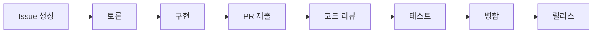

# 🤝 Contributing to AI Intelligence Explosion Detection Red Team

우리는 AI 안전성 연구에 기여하고자 하는 모든 분들의 참여를 환영합니다! 이 프로젝트는 투명성과 협업을 통해 AI의 잠재적 위험을 조기에 발견하는 것을 목표로 합니다.

## 🌟 기여 방식

### 1. 코드 기여
- **탐지 알고리즘 개선**: 새로운 패턴 인식 방법 제안
- **시나리오 추가**: 새로운 레드팀 테스트 시나리오 개발
- **성능 최적화**: 실시간 모니터링 성능 향상
- **테스트 커버리지**: 단위 테스트 및 통합 테스트 추가

### 2. 연구 기여
- **논문 리뷰**: 최신 AI 안전성 연구 동향 공유
- **벤치마크 데이터셋**: 표준화된 평가 데이터 제공
- **사례 연구**: 실제 AI 시스템 분석 결과 공유
- **국제 표준**: EU AI Act, NIST 등 규정 업데이트

### 3. 문서화 기여
- **튜토리얼 작성**: 사용법 가이드 및 예제
- **번역**: 다국어 지원 (한국어, 영어, 일본어 등)
- **API 문서**: 개발자 친화적 문서 개선
- **보안 가이드**: 책임감 있는 공개 정책 개선

### 4. 번역 및 국제화 기여
- **언어 추가**: 새로운 언어 지원 추가
- **번역 품질 개선**: 기존 번역의 정확성 향상
- **문화적 적응**: 각 지역에 맞는 표현 및 예시
- **번역 자동화**: 번역 워크플로우 개선

> 📘 **번역 가이드**: 자세한 국제화 가이드는 [INTERNATIONALIZATION.md](docs/INTERNATIONALIZATION.md)를 참고하세요.

## 🚀 시작하기

### 개발 환경 설정

```bash
# 1. 저장소 포크 및 클론
git clone https://github.com/YOUR_USERNAME/intelligence-explosion-detection.git
cd intelligence-explosion-detection

# 2. 가상환경 생성
python -m venv .venv
source .venv/bin/activate  # Linux/Mac
# 또는
.venv\Scripts\activate     # Windows

# 3. 의존성 설치
pip install -r requirements.txt
pip install -r requirements-dev.txt

# 4. 개발 브랜치 생성
git checkout -b feature/your-feature-name
```

### 테스트 실행

```bash
# 전체 테스트 실행
pytest

# 커버리지 포함 테스트
pytest --cov=src --cov-report=html

# 특정 모듈 테스트
pytest tests/test_detector.py -v
```

## 📋 기여 프로세스

### 1. Issue 생성
새로운 기능이나 버그 수정을 시작하기 전에 Issue를 생성해주세요:

- **Feature Request**: 새로운 기능 제안
- **Bug Report**: 버그 신고
- **Security Vulnerability**: 보안 취약점 (민감한 경우 비공개)
- **Research Discussion**: 연구 관련 토론
- **Documentation**: 문서 개선 제안

### 2. Pull Request 가이드라인

#### PR 체크리스트
- [ ] 관련 Issue 번호 연결 (`Fixes #123`)
- [ ] 코드 스타일 가이드 준수 (black, flake8)
- [ ] 새로운 테스트 추가 (최소 80% 커버리지)
- [ ] 문서 업데이트 (필요시)
- [ ] CHANGELOG.md 업데이트
- [ ] 보안 검토 완료

#### PR 템플릿
```markdown
## 변경 사항 요약
<!-- 무엇을 변경했는지 간단히 설명 -->

## 관련 Issue
Fixes #(issue_number)

## 변경 타입
- [ ] 새로운 기능 (feature)
- [ ] 버그 수정 (bugfix)
- [ ] 문서 개선 (docs)
- [ ] 리팩토링 (refactor)
- [ ] 테스트 추가 (test)
- [ ] 보안 개선 (security)

## 테스트 방법
<!-- 변경사항을 테스트하는 방법 설명 -->

## 보안 고려사항
<!-- 보안에 미치는 영향 검토 -->
```

## 🔒 보안 및 책임감 있는 공개

### 취약점 발견 시
1. **즉시 공개하지 마세요**
2. [Security Policy](SECURITY.md) 참조
3. 비공개 채널로 보고: security@ai-redteam.org
4. 30일 CVD (Coordinated Vulnerability Disclosure) 프로세스 준수

### 민감한 연구 결과
- 이중 사용 가능성이 있는 연구는 신중히 검토
- 윤리 위원회 승인 필요시 먼저 상의
- 해악보다 이익이 클 때만 공개

## 🎯 우선순위 기여 영역

### 🔥 긴급 필요 영역
1. **PyRIT 통합**: Microsoft PyRIT 프레임워크 실제 연동
2. **다국어 지원**: 한국어 외 영어, 일본어 인터페이스
3. **실시간 API**: HuggingFace, OpenAI API 연동
4. **모바일 대시보드**: 스마트폰 친화적 모니터링

### 🌟 고급 연구 영역
1. **멀티모달 탐지**: 텍스트+이미지+음성 통합 분석
2. **연합학습 모니터링**: 분산 AI 시스템 감시
3. **양자 컴퓨팅 대비**: 양자 AI 안전성 연구
4. **뇌-컴퓨터 인터페이스**: BCI-AI 상호작용 모니터링

## 🏆 기여자 인정 시스템

### 기여 배지 시스템
- 🥇 **Gold Contributor**: 10+ 승인된 PR
- 🥈 **Silver Contributor**: 5+ 승인된 PR  
- 🥉 **Bronze Contributor**: 1+ 승인된 PR
- 🔬 **Research Contributor**: 논문/연구 기여
- 🛡️ **Security Researcher**: 취약점 발견
- 📚 **Documentation Master**: 문서화 기여
- 🌍 **Community Leader**: 커뮤니티 활동

### 월간 기여자 하이라이트
- README.md에 "이달의 기여자" 섹션
- LinkedIn/Twitter에서 기여자 소개
- 학회 발표 시 기여자 크레딧

## 📞 커뮤니티 및 소통

### 토론 채널
- **GitHub Discussions**: 일반적인 토론 및 Q&A
- **Discord Server**: 실시간 채팅 (계획 중)
- **Monthly Meetup**: 온라인 월례 모임 (계획 중)
- **Research Webinar**: 분기별 연구 세미나

### 멘토링 프로그램
- 신규 기여자를 위한 멘토 매칭
- 대학생 인턴십 프로그램
- AI 안전성 연구 스터디 그룹

## 📜 행동 강령

### 우리의 약속
- **포용성**: 모든 배경의 기여자 환영
- **존중**: 건설적이고 예의바른 소통
- **투명성**: 오픈소스 정신 준수
- **안전성**: 책임감 있는 AI 연구
- **협력**: 경쟁보다는 협업 우선

### 금지 행위
- 차별적 언행 및 괴롭힘
- 악의적 코드 제출
- 민감한 정보 무단 공개
- 상업적 스팸 및 광고
- 연구 윤리 위반

## 🔄 기여 생명주기



## 📈 성과 측정

### 커뮤니티 성장 지표
- 활성 기여자 수
- 월간 PR/Issue 수
- 코드 커버리지 향상
- 보안 취약점 발견율
- 국제 표준 준수도

### 연구 임팩트 지표
- 학술 논문 인용 수
- 산업계 도입 사례
- 정부 정책 반영
- 국제 표준 기여

---

**함께 만들어가는 안전한 AI의 미래 🚀**

질문이나 제안사항이 있으시면 언제든지 [토론 게시판](../../discussions)에서 소통해주세요!
